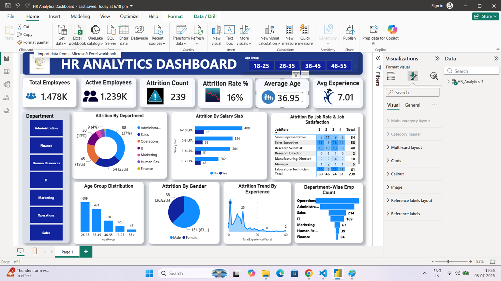

# HR Analytics Dashboard

## Project Overview

This project is an interactive HR Analytics Dashboard built in Power BI to analyze employee data and provide insights into workforce trends, employee attrition, demographics, and performance indicators. The dashboard helps HR teams make data-driven decisions.

---

## Objectives

* Analyze employee attrition.
* Understand workforce demographics.
* Monitor employee performance metrics.
* Identify trends by age, gender, department, education, and job role.
* Support strategic HR decision-making.

---

## Tools Used

* Power BI
* Microsoft Excel / CSV
* Data Cleaning
* Data Visualization

---

## Dataset

**File:** `HR_Analytics.csv`

The dataset contains HR-related information such as:

* Employee ID
* Age
* Gender
* Department
* Job Role
* Education
* Salary
* Attrition
* Years at Company
* Job Satisfaction
* Performance Rating

---

## Dashboard Features

* Overall Employees
* Attrition Count
* Attrition Rate
* Average Age
* Average Salary
* Department-wise Analysis
* Gender Distribution
* Age Group Analysis
* Job Role Analysis
* Interactive Filters (Slicers)

---

## Dashboard Preview

> Add your dashboard screenshot below after uploading `Dashboard.png`.

```markdown

```

---

## Key Insights

* Identified departments with the highest employee attrition.
* Compared attrition across age groups and genders.
* Analyzed salary and experience trends.
* Highlighted workforce distribution across departments and job roles.

---

## Project Files

```text
HR-Analytics-Dashboard/
│── HR Analytics Dashboard.pbix
│── HR_Analytics.csv
│── Dashboard.png
│── README.md
```

---

## How to Open the Project

1. Download the repository.
2. Open `HR Analytics Dashboard.pbix` using Power BI Desktop.
3. If prompted, reconnect the dataset (`HR_Analytics.csv`).
4. Explore the interactive dashboard.

---

## Skills Demonstrated

* Data Cleaning
* Data Modeling
* DAX
* Data Visualization
* Dashboard Design
* Business Intelligence
* HR Analytics

---

## Author

**Gunjan Sharma**

GitHub: https://github.com/sharmagunjan0391
